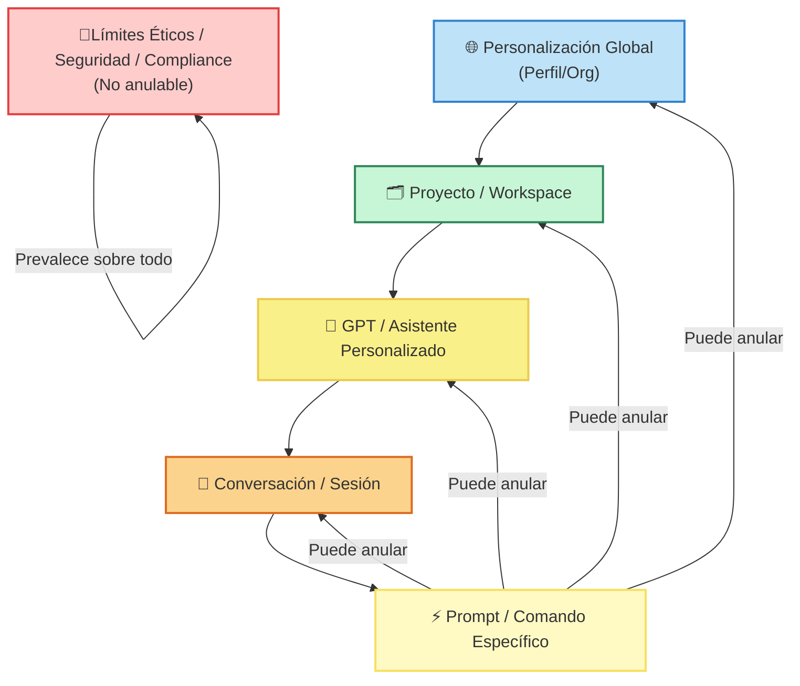

# Diagrama Visual — Jerarquía de Instrucciones (AingZ\_Repo)

> Borrador visual | Versión 2025-07-13 | Autor: GZ (AingZ)

---

## DIAGRAMA (formato texto, para pasar a herramienta visual si lo deseas)

---

## LEYENDA

- **🚦 Límites Éticos / Seguridad / Compliance:** No pueden ser anulados por ninguna instrucción inferior.
- **🌐 Personalización Global:** Valores, políticas y parámetros que aplican a todo el entorno/organización.
- **🗂️ Proyecto / Workspace:** Objetivos, reglas y outputs específicos de un área o proyecto.
- **🤖 GPT / Asistente Personalizado:** Skills, reglas y personalidad asignada a un asistente concreto.
- **💬 Conversación / Sesión:** Instrucciones temporales dadas en el contexto de una conversación activa.
- **⚡ Prompt / Comando Específico:** Instrucciones puntuales o excepcionales que pueden anular instrucciones de capas superiores solo para esa respuesta.

---

## OBSERVACIONES Y REGLAS CLAVE

- **Precedencia:**
  - El prompt/comando puntual tiene máxima precedencia para la respuesta actual.
  - Las capas se heredan descendiendo (global → proyecto → gpt → sesión → prompt).
  - Excepciones y límites (ética/seguridad/compliance) siempre prevalecen.
- **Anulación:**
  - Un prompt puede anular instrucciones superiores SOLO de forma temporal.
  - Para anulación persistente, se debe modificar la instrucción en la capa superior correspondiente.
- **Herencia:**
  - Todo lo no explicitamente anulado se hereda de la capa superior más cercana.
- **Conflicto:**
  - Si dos instrucciones de igual peso compiten, se prioriza la más reciente o la más específica.
- **Memoria y Feedback:**
  - La memoria puede hacer persistente una instrucción dada en capa inferior, si así se configura (ver features MEM, IFB, CTX de la matriz).

---

## REFERENCIAS Y FUENTES

- [README master\_plan](README.md)
- [master\_plan\_aingz\_infrastructure.md](master_plan_aingz_infrastructure.md)
- [matriz\_extendida\_features\_chatgpt\_workflow.md](matriz_extendida_features_chatgpt_workflow.md)
- [docs/croquis-mapeo-features-prompts.md](docs/croquis-mapeo-features-prompts.md)
- [matrices/control\_trazabilidad\_fuentes\_chatgpt\_workflow.md](matrices/control_trazabilidad_fuentes_chatgpt_workflow.md)

---

¿Te gustaría que exporte este diagrama a PNG/SVG o lo subo a alguna herramienta visual (excalidraw, diagrams.net, etc)?

