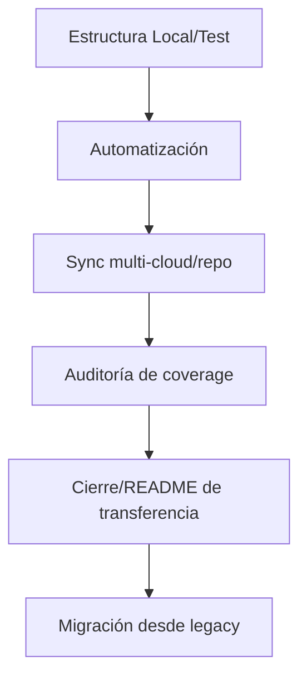

# Canvas T3 RAW GOLD Integrado — Manejo de Base de Datos y Archivos

---

## 1. Propósito y Alcance

- Mapear, auditar y optimizar la gestión integral de archivos, carpetas y plataformas en la infraestructura AingZ\_Repo.
- Asegurar cobertura total, automatización y trazabilidad desde el entorno local hasta la integración multi-cloud/repo.
- Garantizar que toda la documentación, templates y workflows sean autoexplicativos y listos para onboarding o migración.

---

## 2. Arquitectura y componentes clave

- **Matriz RAW GOLD**: Blueprint principal, define cada carpeta, tipo de archivo, plataforma, APIs, automatización, coverage y gaps.
- **Knowledge base**: Registro vivo de aprendizajes, reglas de oro, feedback y mejoras iterativas.
- **README central y por carpeta**: Documentación mínima obligatoria y punto de partida para nuevos colaboradores/asistentes.
- **Plantillas base**: Onboarding ágil para cada área crítica: knowledge, matrices, workflows, scripts, logs, docs, configs/env.
- **Automatización**: Scripts de sync, backup, triggers, logs y validación.

---

## 3. Metodología aplicada

- **Análisis RAW**: Barrido exhaustivo del contexto y casos límite.
- **Matriz modular**: Estructuración granular por componente, tipo, función y coverage.
- **Coverage checklist**: Validación sistemática por ejemplo y template real.
- **Versionado y trazabilidad**: Naming, changelog, logs y convención de snapshots para cada ciclo/avance.
- **Documentación cruzada**: Referencias obligatorias a master plan, matriz extendida de features, knowledge base y workflows.

---

## 4. Fases del roadmap de despliegue

1. **Despliegue y testing local**
   - Estructura de carpetas, README, templates y ejemplos dummy.
   - Validación de workflows de alta, edición, backup, logs y versionado local.
2. **Automatización local**
   - Scripts para sync, backup y logs automáticos.
   - Triggers manuales/automáticos y validación de logs/coverage.
3. **Integración multi-cloud/repo**
   - Configuración de APIs/SDKs, sync real entre local y cloud, ajuste de permisos.
   - Validación de versionado, permisos, backup y troubleshooting.
4. **Testing end-to-end y cierre**
   - Simulación de flujos reales, auditoría de coverage, consolidación de logs/aprendizajes.
   - Actualización de README, matrices y knowledge.
5. **Cierre y migración**
   - README de cierre, checklist completa, transferencia a knowledge base global, migración desde estructura legacy.

---

## 5. Reglas de oro y recomendaciones

- Nunca sobrescribir históricos, siempre versionar y documentar cada cambio.
- Checklist y logging obligatorios en cada ciclo/avance.
- Onboarding y transferencia siempre deben partir de README, matriz y master plan.
- La migración desde repositorios legacy debe validar coverage y compatibilidad en cada área.

---

## 6. Diagrama visual (opcional)

---

> Este canvas resume la visión, etapas y metodología del ciclo T3 RAW GOLD y es la guía maestra para migración y escalado de la infraestructura AingZ\_Repo.

