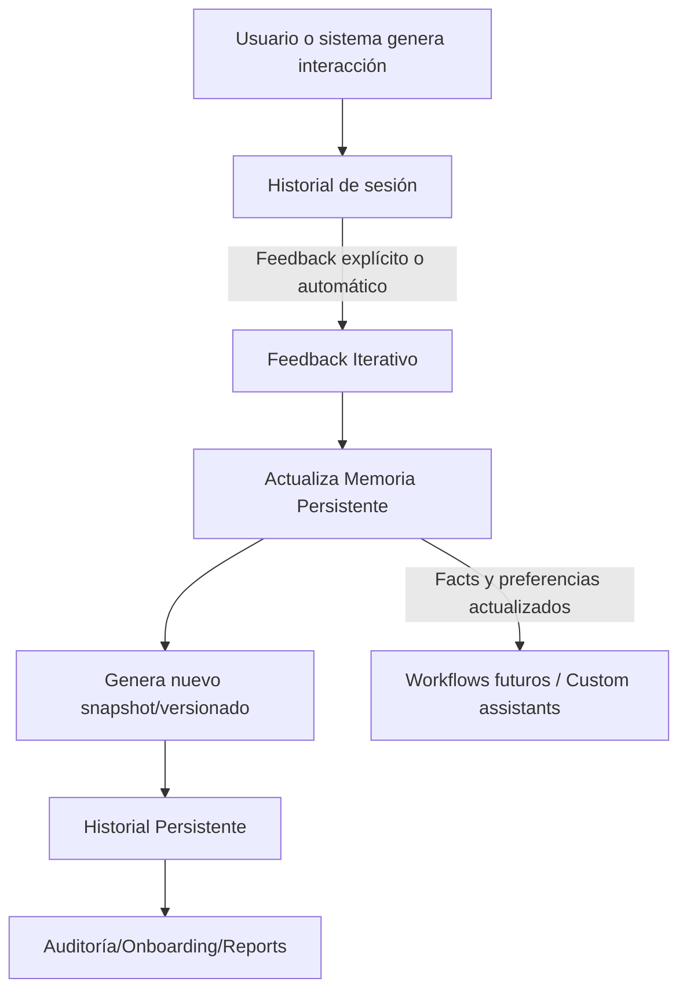

# Ejemplo de Integración — Memoria Persistente + Feedback + Historial (AingZ\_Repo)

---

## Descripción general

Flujo de integración RAW y full custom entre memoria persistente, feedback iterativo y registros de historial en el entorno AingZ\_Repo. Este ejemplo no está orientado a ningún caso específico, y puede adaptarse a cualquier proyecto, asistente, equipo o workflow.

---

## Diagrama de flujo

---

## Secuencia de pasos

1. **Interacción:** Usuario o sistema inicia una acción (consulta, prompt, tarea automatizada).
2. **Registro en historial de sesión:** Todo lo conversado queda temporalmente en el historial de sesión.
3. **Feedback:** Puede ser explícito (el usuario corrige, califica, aporta preferencia) o automático (detección de errores, patrones de uso).
4. **Integración de feedback:** El feedback relevante se transfiere a la memoria persistente (facts, preferencias, flags).
5. **Actualización/versionado:** Se genera un snapshot de la memoria, documentando cambios, contexto y referenciando features clave.
6. **Historial persistente:** Los snapshots/versionados alimentan el historial general de proyecto, asistente o workflow.
7. **Auditoría/onboarding:** Cualquier ciclo de revisión, nuevo usuario o análisis toma como base este historial.
8. **Reutilización:** Workflows futuros y asistentes custom acceden a la memoria persistente y su historial para optimizar decisiones, outputs y experiencia.

---

## Ejemplo de estructura de archivos generados

- `/matrices/memoria_persistente_20250714_v2.json`
- `/matrices/feedback_iterativo_20250714_v2.md`
- `/matrices/historial_general_20250714.md`

---

## Notas clave

- La retroalimentación y aprendizaje se integran cíclicamente y quedan versionados.
- Cada snapshot puede relacionar feedback, facts y outputs previos para máxima trazabilidad.
- Se recomienda siempre documentar el motivo del cambio y las features actualizadas en la memoria.
- La estructura es neutral, adaptable y alineada al modelo de matriz extendida y master plan.

