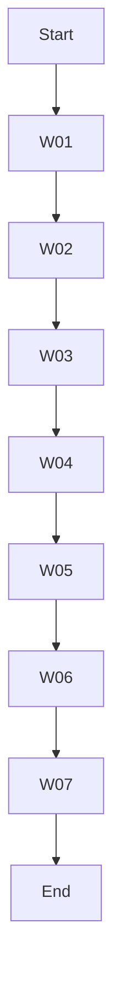

# 🔧 [RwB] WF_INICIO_REPO_CHECK — v1 (2025-07-31)

> **Código WF:** `WF_INIT` (Workflow Init Check) — definido en el *Glosario CODE v2* sección D.\
> **Propósito:** Ejecutar una rutina de control al comenzar cada sesión: chequeo de cambios, referencias cruzadas y actualización de registros.

---

## 🔝 Instrucciones de uso
1. Ejecuta este workflow en la raíz del repo antes de hacer modificaciones.
2. Asegúrate de contar con Python 3.8+, `git` y los scripts de `/scripts` instalados.

---

## W. PASOS DEL WORKFLOW

| ID  | Paso                     | CODE/Tool | Descripción                                                   | Output                                  |
| --- | ------------------------ | --------- | ------------------------------------------------------------- | --------------------------------------- |
| W01 | Actualizar repositorio   | GIT       | `git pull` para sincronizar con remoto.                      | repo actualizado                         |
| W02 | Scan cambios locales     | DIFF      | `git status` + `git diff` para detectar modificaciones.      | `diff_session.log`                      |
| W03 | Mapping Legacy           | MAP       | Ejecutar `python scripts/mapping.py --no-header`.            | `registro_trazabilidad_total.md`        |
| W04 | CrossRef Matrix/Glosario | XRF       | Validar códigos nuevos vs Matrix y Glosario.                 | `xrf_report.md`                         |
| W05 | Actualizar Changelog     | CHG       | Registrar entrada de sesión en `chglog_main_rwb_v_5_20250730_actv.md`.    | changelog actualizado                   |
| W06 | Correr Pruebas           | TST       | `pytest -q` para validar scripts.                            | reporte pytest                          |
| W07 | Commit sesión            | GIT       | `git add` + `git commit` (push opcional).                    | commit                                  |

---

## 📊 Diagrama de Flujo (Mermaid)

---

## 📝 Metadatos

| Campo        | Valor                         |
| ------------ | ----------------------------- |
| Versión      | v1                            |
| Fecha        | 2025-07-31                    |
| Autor/es     | Gastón Zelechower · OpenAI o3 |
| Glosario ref | v2                            |

---

### Firma
> Gastón Zelechower · OpenAI o3 — Ruleset RWB Universal

---

**FIN — WF_INICIO_REPO_CHECK v1**

