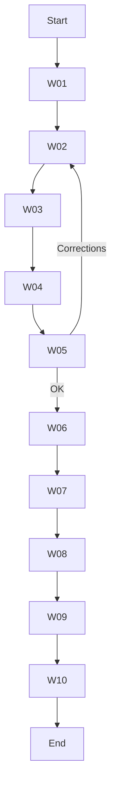

# 🔄 [RwB] WF\_RELEV\_HILO\_ASSETS — v1 (2025-07-29)

> **Código WF:** `WF_RHA` (Workflow Relev Hilo Assets) — definido en el *Glosario CODE v2* sección D (Workflow & Pipelines).\
> **Propósito:** Ejecutar un **barrido literal** sobre un hilo (Chat + Canvas) para identificar **assets nuevos o actualizados**, registrar diferencias y alimentar el Glosario/Diccionario.

---

## 🔝 Instrucciones de uso

1. **CTX:** Seleccionar hilo/carpeta objetivo.
2. **BLN:** Crear snapshot inicial (`BLN`) antes de comenzar.
3. **LITW:** Extraer texto plano de todos los mensajes y adjuntos.
4. **DIFF:** Detectar cambios respecto a la última versión en `ACTV`.
5. **CLSS/MAPX:** Clasificar cada asset y asignar `CODE` correspondiente.
6. **CHK → CHKP:** Validar cobertura total.
7. **RPT:** Generar reporte `rpt_relev_hilo_assets.md`.
8. **MIG:** Migrar assets validados a carpeta `ACTV`.
9. **GLS\_UPDATE & DICT\_SYNC:** Actualizar glosario y diccionario.
10. **CHG:** Registrar entrada en changelog global.

---

## W. PASOS DEL WORKFLOW

| ID  | Paso                    | CODE/Tool        | Descripción                    | Output                     |
| --- | ----------------------- | ---------------- | ------------------------------ | -------------------------- |
| W01 | Baseline snapshot       | BLN              | `bk create` en hilo.           | `BLN_<date>.zip`           |
| W02 | Literal Sweep           | LSWP+LITW        | Extrae texto y adjuntos.       | `sweep_raw.txt`            |
| W03 | Detect DIFF             | DIFF             | `diff` contra BLN anterior.    | `diff_report.md`           |
| W04 | Clasificar Assets       | CLSS + MAPX      | Asignar `CODE` según glosario. | `assets_classified.csv`    |
| W05 | Checklist QA            | CHK + CHKP       | Validar 100 % cobertura.       | `chk_results.md`           |
| W06 | Generar Reporte         | RPT              | Resumen ejecutivo.             | `rpt_relev_hilo_assets.md` |
| W07 | Migrar a ACTV           | MIG              | Copiar/renombrar assets.       | assets en `/ACTV`          |
| W08 | Actualizar Glosario     | TSK\:GLS\_UPDATE | Añadir/editar entradas (🟧).   | PR/commit                  |
| W09 | Sincronizar Diccionario | TSK\:DICT\_SYNC  | Bot diff → update.             | commit                     |
| W10 | Registrar Cambio        | CHG              | Entrada en changelog.          | `CHG.md`                   |

---

## 📊 Diagrama de Flujo (Mermaid)

---

## 📝 Metadatos

| Campo        | Valor                         |
| ------------ | ----------------------------- |
| Versión      | v1                            |
| Fecha        | 2025-07-29                    |
| Autor/es     | Gastón Zelechower · OpenAI o3 |
| Glosario ref | v2                            |

---

### Firma

> Gastón Zelechower · OpenAI o3 — Ruleset RWB Universal

---

**FIN — WF\_RELEV\_HILO\_ASSETS v1**

