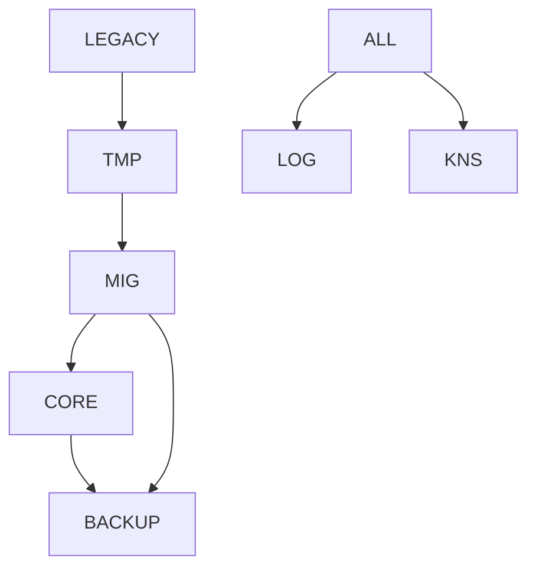

# Crossref & Mapping de Buckets — AingZ\_Platform v1 (2025-07-31)

> Esquema exhaustivo de referencias cruzadas y mapping entre buckets/folders principales, asegurando máxima trazabilidad, update instantáneo, y compatibilidad con herramientas tipo Obsidian, scripts automáticos y visualización/QA. 100% alineado a RwB+.

---

## 1. Principios de crossref y mapping bucket-based

- **Todas las rutas, enlaces y referencias deben ser a nivel de bucket**, nunca archivos individuales.
- Cada bucket principal tiene README con crossref automático (Mermaid, Markdown links, templates).
- El mapping central y los scripts de generación usan solo rutas de directorio.
- Los workflows y pipelines usan templates universales que operan por bucket/categoría.
- El mapping debe ser portable, versionable y legible para IA, humanos y apps tipo Obsidian.

---

## 2. Tabla de crossref buckets

| Bucket          | Referencia ascendente | Referencias laterales   | Buckets destino típicos | Crossref README |
| --------------- | --------------------- | ----------------------- | ----------------------- | --------------- |
| LEGACY/         | Ingreso manual/auto   | TMP/, MIG/              | TMP/, MIG/              | Sí              |
| TMP/            | LEGACY/, scripts dev  | MIG/, CORE/             | MIG/, CORE/             | Sí              |
| MIG/            | LEGACY/, TMP/         | CORE/, BACKUP/          | CORE/, BACKUP/          | Sí              |
| CORE/           | MIG/                  | BACKUP/, LOG/           | BACKUP/                 | Sí              |
| BACKUP/         | CORE/, MIG/           | -                       | -                       | Sí              |
| LOG/            | Todos                 | AUDT/, KNS/LEARN/       | -                       | Sí              |
| KNS/            | Todos (insights)      | LEARN/                  | -                       | Sí              |
| DATA/           | CORE/, TMP/, MIG/     | -                       | -                       | Sí              |
| SCR/            | CORE/, TMP/, MIG/     | -                       | -                       | Sí              |
| DOC/            | CORE/                 | -                       | -                       | Sí              |
| WF/             | CORE/, TMP/, MIG/     | -                       | -                       | Sí              |
| CONNECTORS/     | Personal, pipelines   | APPS/, PIPELINES/       | -                       | Sí              |
| APPS/           | Personal, pipelines   | CONNECTORS/, PIPELINES/ | -                       | Sí              |
| PIPELINES/      | Personal, scripts     | CONNECTORS/, APPS/      | -                       | Sí              |
| SNAPSHOTS\_CTX/ | MIG/, TMP/            | -                       | -                       | Sí              |
| INFRA/          | Deploy, scripts       | -                       | -                       | Sí              |

---

## 3. Crossref Markdown template (README.md por bucket)

```markdown
# [BUCKET] — Crossref y Mapping

- **Referencia ascendente:** [../]
- **Referencias laterales:** [./BUCKET_LATERAL1/], [./BUCKET_LATERAL2/]
- **Buckets destino típicos:** [../DESTINO/]
- **Crossref central:** [Mapa Global](../DOC/MPLN/crossref_global.md)
- **Flujos/Pipelines relevantes:** [../WF/pipeline_BUCKET.md], [../PIPELINES/pipeline_BUCKET.md]
```

- Agregar tablas Mermaid (subdir) y links Obsidian si se usa como vault (ej: `[[CORE/]]` para cross-link directo).

---

## 4. Mapping centralizado global

- Ubicado en `/DOC/MPLN/crossref_global.md` o `/DOC/README.md`, incluye:
  - Tabla de crossref buckets.
  - Mermaid graph de dependencias entre buckets.
  - Referencia a templates de pipelines/workflows por bucket.

### Ejemplo Mermaid



---

## 5. Script auto-generador de directorios + README crossref

- Generar estructura de folders según árbol validado.
- Para cada bucket, crear `README.md` con plantilla crossref auto-rellenada.
- Linkeos compatibles Obsidian/Markdown y Mermaid para visualización y navegación.

### Ejemplo de script Python (bosquejo):

```python
import os
from pathlib import Path

BUCKETS = [
    'packages', 'WF', 'DOC', 'KNS', 'KNS/LEARN', 'SCR', 'DATA', 'LOG', 'LOG/AUDT',
    'BACKUP', 'BACKUP/INT', 'BACKUP/EXT', 'BACKUP/AI', 'LEGACY', 'TMP', 'MIG', 'CORE',
    'CONNECTORS', 'APPS', 'PIPELINES', 'SNAPSHOTS_CTX', 'SNAPSHOTS_CTX/o3',
    'SNAPSHOTS_CTX/gpt4', 'SNAPSHOTS_CTX/turbo', 'SNAPSHOTS_CTX/custom', 'INFRA'
]

TEMPLATE = '''# [{bucket}] — Crossref y Mapping

- **Referencia ascendente:** [../]
- **Referencias laterales:** (auto-link)
- **Buckets destino típicos:** (auto-link)
- **Crossref central:** [Mapa Global](../DOC/MPLN/crossref_global.md)
'''

for bucket in BUCKETS:
    path = Path(bucket)
    path.mkdir(parents=True, exist_ok=True)
    (path / 'README.md').write_text(TEMPLATE.format(bucket=bucket.upper()))
```

---

> **Fin crossref & mapping bucket-based v1 — AingZ\_Platform.** Listo para aplicar, ajustar links o exportar a Obsidian/Markdown.

