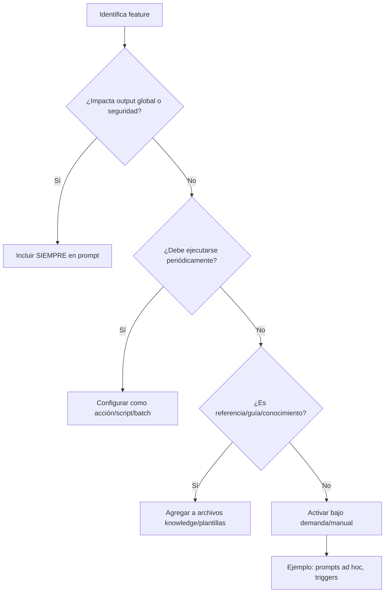

# CROQUIS DE MAPEOS, ESTRUCTURAS Y RELACIONES – FEATURES & PROMPTS CHATGPT

> Este documento resume el análisis y propuesta de mapeo óptimo de features, su “domicilio” recomendado (prompt, acción, archivo, knowledge base, etc.), su frecuencia de uso y correlaciones en la personalización avanzada de ChatGPT, GPTs custom y proyectos IA.

---

## A. TABLA ESTRUCTURAL – ENTRADAS Y CAPACIDADES SEGÚN CONTEXTO

| Entorno / Entrada            | ¿Permite prompt? | Instrucciones vivas | Archivos/scripts | Acciones externas | Contexto especial                            |
| ---------------------------- | ---------------- | ------------------- | ---------------- | ----------------- | -------------------------------------------- |
| ChatGPT Personalización      | ✅ (limite 1500)  | ❌                   | ❌                | ❌                 | Solo tres prompts iniciales.                 |
| Custom GPTs                  | ✅                | ✅                   | ✅                | ✅                 | Knowledge y actions programables.            |
| Proyectos / Assistants (API) | ✅                | ✅                   | ✅                | ✅                 | Prompt + archivos + memory larga.            |
| Uso directo (prompt ad hoc)  | ✅                | ✅                   | ❌                | ❌                 | Solo testing/manual, no automatización real. |

---

## B. CLASES DE FEATURES Y “DOMICILIO ÓPTIMO”

| Clase       | ¿En prompt siempre?  | ¿Periódico/manual?      | ¿Archi../knowledges?    | ¿Acción/script?    | Frecuencia recomendada           | Ejemplos típicos                          |
| ----------- | -------------------- | ----------------------- | ---------------------- | ------------------ | -------------------------------- | ----------------------------------------- |
| CORE        | Solo inicialización  | ⚠️ Sí, monitor/autotest | ✔️ Docs y ejemplos     | ✔️ Sí              | Diaria (logs), semanal (actions) | Interpreter, Data analysis, Browsing      |
| OUTPUT      | ✔️ Siempre           | ⚠️ Depende workflow     | ✔️ Plantillas          | ⚠️ Export/batch    | Constante/interacción            | Output dirigido, nivel detalle, modular   |
| DATA        | ⚠️ Según enfoque     | ✔️ Chequeos cíclicos    | ✔️ Plantillas/guías    | ✔️ Backups/version | Semanal/proyecto                 | Gestión, segmentación, checkpoints        |
| WORKFLOW    | ✔️ Modularidad, modo | ✔️ Feedback, chaining   | ✔️ Checklists, docs    | ✔️ Testing/loops   | Constante/interacción            | RAW/específico, persistencia, feedback    |
| SECURITY    | ✔️ Siempre (hard)    | ✔️ Auditorías/logs      | ✔️ Policies            | ✔️ Monitoreo       | Constante y trimestral           | Anti-jailbreak, protección, aclaración    |
| USER-EXP    | ✔️ Preferido         | ⚠️ Sugerencias          | ✔️ Ejemplos/plantillas | ✔️ Notifs          | Interacción/finalización         | Idioma, tono, explicación, próximos pasos |
| INTEGRATION | ⚠️ Según uso         | ✔️ Triggers/sync        | ✔️ Config scripts      | ✔️ Sync            | Según proyecto/infra             | Integración, roles, internacionalización  |
| EVAL        | ⚠️ Cuando relevante  | ✔️ Autoeval/logs        | ✔️ Scripts/metrics     | ✔️ Batch evals     | Cierre/etapa, semanal            | Fine-tuning, evals, sim/predicción        |

Leyenda: ✔️ = Recomendado, ⚠️ = Según caso de uso.

---

## C. FRECUENCIA DE USO RECOMENDADA (para features fuera de prompt)

- **CORE:** Log y autotest diarios, acciones semanales o según cambios críticos.
- **OUTPUT:** Verificación cada interacción, export/batch según entrega.
- **DATA:** Plantillas y backups semanales, segmentación por etapa/proyecto.
- **WORKFLOW:** Feedback y chaining por interacción, testing continuo.
- **SECURITY:** Auditoría/log trimestral, monitoreo permanente, políticas siempre vigentes.
- **USER-EXP:** Sugerencias/finalización por interacción, ejemplos plantillas periódicos.
- **INTEGRATION:** Triggers/sync según cambio de infra/proyecto.
- **EVAL:** Autoevals en cierre de entregas, scripts batch por semana/mes.

---

## D. DIAGRAMA DE FLUJO — DECISIÓN “DÓNDE UBICAR LA FEATURE”



---

## E. MAPA CONCEPTUAL — RELACIÓN ENTRE CLASES, DOMICILIO Y FRECUENCIA

```mermaid
graph LR
    subgraph PROMPT
        C1[OUTPUT]
        C2[SECURITY]
        C3[USER-EXP]
        C4[WORKFLOW]
    end
    subgraph ACCIONES / SCRIPTS
        S1[CORE]
        S2[DATA]
        S3[EVAL]
        S4[INTEGRATION]
    end
    subgraph ARCHIVOS / KNOWLEDGE
        K1[DATA]
        K2[OUTPUT]
        K3[WORKFLOW]
        K4[INTEGRATION]
    end

    C1 -->|Formato, claridad| PROMPT
    C2 -->|Seguridad, ética| PROMPT
    C3 -->|Idioma, tono| PROMPT
    C4 -->|Modo, feedback| PROMPT

    S1 -->|Test, logs| ACCIONES / SCRIPTS
    S2 -->|Backups, gestión| ACCIONES / SCRIPTS
    S3 -->|Eval batch| ACCIONES / SCRIPTS
    S4 -->|Sync, triggers| ACCIONES / SCRIPTS

    K1 -->|Checklists, templates| ARCHIVOS / KNOWLEDGE
    K2 -->|Ejemplos de output| ARCHIVOS / KNOWLEDGE
    K3 -->|Docs de proceso| ARCHIVOS / KNOWLEDGE
    K4 -->|Config scripts| ARCHIVOS / KNOWLEDGE

    PROMPT --"Siempre activos"--> OUTPUT
    PROMPT --"Siempre activos"--> SECURITY
    PROMPT --"Personalización"--> USER-EXP
    PROMPT --"Workflow base"--> WORKFLOW

    ACCIONES / SCRIPTS --"Periodico"--> CORE
    ACCIONES / SCRIPTS --"Cíclico/Testing"--> DATA
    ACCIONES / SCRIPTS --"Validación"--> EVAL
    ACCIONES / SCRIPTS --"Infraestructura"--> INTEGRATION

    ARCHIVOS / KNOWLEDGE --"Referencia"--> DATA
    ARCHIVOS / KNOWLEDGE --"Plantillas"--> OUTPUT
    ARCHIVOS / KNOWLEDGE --"Docs vivas"--> WORKFLOW
    ARCHIVOS / KNOWLEDGE --"Configuración"--> INTEGRATION
```

---

## F. MATRIZ CRUZADA — DOMICILIO, FRECUENCIA Y CASO DE USO

| Clase       | En Prompt | Acción/Script | Archivo/Knowledge | Frecuencia     | Caso de uso óptimo                            |
| ----------- | --------- | ------------- | ----------------- | -------------- | --------------------------------------------- |
| CORE        | Opcional  | ✔️            | ✔️                | Diario/semanal | Autotest, logging, batch, integración         |
| OUTPUT      | ✔️        | Opcional      | ✔️                | Siempre        | Output dirigido, formatos, reporting          |
| DATA        | Opcional  | ✔️            | ✔️                | Proyecto       | Checkpoints, segmentación, backups            |
| WORKFLOW    | ✔️        | ✔️            | ✔️                | Siempre        | Modularidad, feedback, checklists             |
| SECURITY    | ✔️        | ✔️            | ✔️                | Siempre        | Políticas, logs, compliance                   |
| USER-EXP    | ✔️        | Opcional      | ✔️                | Siempre        | Personalización, onboarding, ejemplos         |
| INTEGRATION | Opcional  | ✔️            | ✔️                | Según stack    | Roles, triggers, internacionalización         |
| EVAL        | Opcional  | ✔️            | ✔️                | Entrega/lote   | Fine tuning, evaluación outputs, simulaciones |

---

## G. NOTAS

- Las recomendaciones de inclusión/frecuencia pueden personalizarse según la criticidad del workflow y el stack tecnológico de tu equipo.
- Features “core” de seguridad y output nunca deben omitirse del prompt principal en entornos productivos.
- Este croquis es una referencia dinámica: adapta y versiona según evolución de tu práctica y releases de OpenAI.

