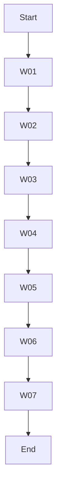

# O3 Instructions and Repo Snapshot

This document consolidates important instructions, context, and file snapshots for operating the repository with the OpenAI model `o3`. It includes prior discussion and key repository documents to provide full context without requiring direct repository access.

## 1. Prior KSN Context

# 📄 KSN — Contexto del Repositorio *RwB_Repo_AingZ*

> **Objetivo:** Resumir la estructura y reglas fundamentales del repositorio para continuar las tareas pendientes con ChatGPT. Se incluyen recomendaciones de buenas prácticas para controlar el contexto.

---

## 1. Archivos clave
- **README principal** (`readme.md`): describe la estructura general, reglas de operación y comandos básicos de instalación y pruebas.
- **Master Plan** (`mpln_master_plan_aingz_rw_b_v_20250729_v_3.md`): hoja de ruta y pilares de evolución.
- **Blueprint de directorio** (`rw_b_dir_arch_plan_v_4_20250729.md`): mapea los buckets principales y sus roles.
- **Glosario CODE v2** (`knowledges/glossary/rw_b_glosario_code_v_2_20250729.md`): normativa de códigos y jerarquía de nombres.
- **Diccionario de Triggers v2** (`rw_b_diccionario_code_triggers_v_2_20250729.md`): lookup rápido para prompts y scripts.
- **Workflow de inicio** (`WF/rw_b_wf_inicio_repo_check_v_1_20250731.md`): rutina de control al comenzar cada sesión.
- **Checklist de avances** (`rw_b_checklist_avances_v_1_20250730.md`): lista de tareas ejecutadas y pendientes.
- **Registro de trazabilidad** (`registro_trazabilidad_total.md`): tabla de mapeo legacy → destino.
- **Scripts** (`scripts/mapping.py`, `scripts/class_scan.py`): utilidades para mapeo y búsqueda.
- **Pruebas** (`tests/`): unit tests de ambos scripts.
- **Guía de bienvenida** (`onbrd_welcome_onboarding_gz_rw_b_v_20250725.md`).
- **Reglas de naming** (`template/naming/`).

## 2. Estructura de carpetas (según DIR_ARCH_PLAN v4)
```
/ (root)
├── WF/
├── DOC/
├── KNS/
├── AUDIT_LIGHT/
├── SCR/
├── DATA/
├── LOG/
├── BACKUP/
├── PURGATORIO/
├── TMP/
└── MIG/
```

## 3. Próximas tareas
1. Aplicar workflows de auditoría, dictado y migración.
2. Completar el mapeo de archivos legacy con `python scripts/mapping.py`.
3. Sincronizar glosario y diccionario.
4. Ejecutar pruebas `pytest` tras cada iteración.
5. Registrar cambios en `chglog_main_rwb_v_4_*.md` y actualizar `registro_trazabilidad_total.md`.

## 4. Buenas prácticas para uso de ChatGPT
- **Chunking y resúmenes** de archivos extensos.
- **Function calling / JSON mode** para datos estructurados.
- **Paginación** de respuestas largas.
- **Monitoreo regular** del tamaño de conversación.

## 5. Archivos sugeridos para adjuntar completos
1. `readme.md`
2. `mpln_master_plan_aingz_rw_b_v_20250729_v_3.md`
3. `rw_b_dir_arch_plan_v_4_20250729.md`
4. `knowledges/glossary/rw_b_glosario_code_v_2_20250729.md`
5. `rw_b_diccionario_code_triggers_v_2_20250729.md`
6. `onbrd_welcome_onboarding_gz_rw_b_v_20250725.md`
7. `rw_b_checklist_avances_v_1_20250730.md`
8. `registro_trazabilidad_total.md`
9. `scripts/mapping.py`
10. `scripts/class_scan.py`
11. `WF/rw_b_wf_inicio_repo_check_v_1_20250731.md`
12. `requirements.txt`

## 6. Notas finales
- Seguir siempre glosario y workflows.
- Registrar todo cambio en logs y changelogs.
- Respetar la plantilla de naming `SRC·STG·ROLE`.

---

## 2. Perfil y Metodología solicitada para el modelo `o3`

El usuario ha indicado que el asistente debe comportarse como un ingeniero especializado en IA, sostenibilidad y tecnologías integradas, siguiendo el perfil profesional de *Gastón Zelechower*. Se resumen a continuación los lineamientos clave:

- **Análisis integral (RAW)** cuando se solicite un abordaje amplio y exploratorio.
- **Análisis iterativo, específico y crítico** orientado a objetivos cuando se solicite de forma explícita.
- **Documentación detallada** de interacciones y conclusiones utilizando Markdown, JSON o sqlite según corresponda.
- **Dominio avanzado** de APIs OpenAI, técnicas de prompt engineering y herramientas (Python, GitHub Actions, Jenkins, Grafana, Prometheus).
- **Enfoque en eficiencia técnica**, KPIs claros, precisión y transparencia en todas las comunicaciones.
- **Valores** de respeto ambiental, autonomía, transparencia e innovación sustentable.

El propósito central es *optimizar integralmente la eficiencia, precisión y personalización* en cada interacción y proyecto.

---

## 3. Snapshots of Key Files

### readme.md
```markdown
# README_CONSOLIDADO_AINGZ_MAIN_20250725_v2.md — Archivo raíz consolidado (AingZ, v2 - 2025-07-25)

---

## 1. Propósito y contexto
Este README centraliza las referencias, estructura, reglas y logs para operar el repo AingZ bajo estándar RwB v2+. Enlaza bitácoras, changelogs y documentación activa para asegurar trazabilidad total.

---

## 2. Estructura general del repositorio (RawBase 2025)
- **WF/** – Workflows activos, logs y bitácora de versiones (`chg_log_wf_purgatorio_20250725.md`)
- **knowledges/** – Glosario, contextos y lessons learned (`rw_b_glosario_code_v_1_core_20250725.md`)
- **Learn/** – Memoria viva incremental
- **template/** – Plantillas de naming y README
- **AUDT/** – Auditorías legacy y bitácoras (`CHG_LOG_AUDITORIA_20250725.md`)
- **doc/** – Documentación formal y master-plans
- **scripts/** – Utilidades y ETL
- **registro_trazabilidad_total.md** – Mapeo automático de archivos legacy → RwB (generado con `scripts/mapping.py`)
- **matrices/** – Matrices de precedencia y trazabilidad
- **backup/** – Respaldo y purgatorio (`backup/purgatorio/`)

---

## 3. Reglas y metodología de operación
- Seguir siempre el glosario core (`knowledges/rw_b_glosario_code_v_1_core.md`) y plantilla de naming (`template/naming/rw_b_naming_template_v_1.md`).
- Usar el plan de directorio (`rwb_repo_directory_plan_v_1.md`), workflows (`WF/`), logs y bitácoras como referencia operativa.
- Toda acción (movimiento, auditoría, integración) debe registrar logs en el archivo o carpeta correspondiente y actualizar el changelog maestro.
- Checklist de cobertura, versionado y referenciación cruzada antes de cada merge, integración o purga.
- Nunca borrar outputs legacy sin respaldo y registro en logs.

---

## 4. Onboarding, logs y changelogs
- La guía de bienvenida (`ONBRD_WELCOME_ONBOARDING_GZ_RW_B_v_20250725.md`) es la referencia inicial para cualquier usuario o IA.
- Logs y changelogs incrementales se mantienen por subcarpeta y se unifican en `CHG_LOG_MAIN_AINGZ_20250725.md`.
- Cada carpeta relevante debe incluir su bitácora o log (WF, AUDT, knowledges, doc). Las guías de onboarding y el master plan se mantienen en archivos raíz.
- Toda actualización mayor debe reflejarse en este README y el changelog principal.

---

## 5. Próximos pasos y automatización
- Para migrar, auditar o refactorizar cualquier lote, seguir el directorio plan + workflows y logs asociados.
- Validar toda estructura y outputs con scripts/checklists y documentar cada acción incrementalmente en logs/changelogs.
- Mantener el changelog maestro como pivote de revisión y onboarding.

---

## 6. Estado y versionado
- Este README v2 consolida y actualiza la documentación raíz al 25-07-2025.
- Toda versión previa se archiva en backup/PURGATORIO tras validar cobertura y migración.

---

## Instalación
Para instalar las dependencias principales ejecuta:

```bash
pip install -r requirements.txt
```

Los paquetes `py-cpuinfo` (cpuinfo), `GPUtil`, `wmi` y `pywin32` son opcionales. Instálalos solo si necesitas información detallada del hardware.

---

## 7. Ejecución de pruebas
Las pruebas unitarias están en la carpeta `tests/`. Para correrlas se utiliza `pytest`:

```bash
pip install pytest  # si no está instalado
pytest
```

## 8. Generar mapeo de legacy
Para actualizar `registro_trazabilidad_total.md` ejecuta el script de mapeo:

```bash
python scripts/mapping.py
```

## 9. Control inicial del repositorio
Para un chequeo rápido de cambios y referencias cruzadas al comenzar una sesión,
revisa el workflow [`WF_INICIO_REPO_CHECK`](WF/rw_b_wf_inicio_repo_check_v_1_20250731.md).

---

## Licencia
Este proyecto se distribuye bajo la licencia MIT. Consulta el archivo [LICENSE](LICENSE) para más información.
```

### mpln_master_plan_aingz_rw_b_v_20250729_v_3.md
```markdown
# 🏗️ MPLN_MASTER_PLAN_AINGZ_RW_B — v3 (2025-07-29)
> **Blueprint arquitectónico y hoja de ruta maestra** del repo RwB.  
> Esta versión integra la reorganización por matrices, blueprint de directorios, workflows iterativos y clasificación de assets en ciclo de vida.
> **Referenciado obligatoriamente en README, DirArchPlan v4, Changelog, Glosario v2 y Matrix v1.**

---

## 🔝 Pilares de la evolución actual (v3)
1. **Alineación absoluta a blueprint de directorios**: todos los activos deben estar ubicados y nombrados según [DIR_ARCH_PLAN v4](rw_b_dir_arch_plan_v4_20250729.md).
2. **Glosario y Diccionario CODE v2**: máxima jerarquía en naming, roles, features IA y prompts.
3. **Matriz de clasificación de assets**: codificación `SRC·STG·ROLE` y rutas de consolidación.
4. **Buckets y workflows nuevos**: `/KNS/TL`, `/AUDIT_LIGHT`, `/TMP`, `/MIG`, `/PURGATORIO/LEGACY`, dictado por voz, training/tuning IA y migración literal.
5. **Feedback IA, voice dictation, training**: outputs de cada iteración se consolidan en workflows, siguiendo ciclo de vida documentado.

---

## 📅 Roadmap resumido
| Fase | Hito | Output clave | Bucket/dir destino | Fecha |
|------|------|-------------|-------------------|-------|
| 1    | Reorganización directorios y assets | Blueprint DirArchPlan v4 | `/` | 2025-07-29 |
| 2    | Glosario v2, Diccionario v2 | Naming y triggers final | `/KNS`, `/DOC` | 2025-07-29 |
| 3    | Matrix v1 | Código compuesto, QA procesos | `/KNS` | 2025-07-29 |
| 4    | Workflows dictado/auditoría/migración | Procedimientos y scripts | `/WF` | 2025-07-29 |
| 5    | Integración de training IA | Outputs TL, retroalimentación | `/KNS/TL`, `/TMP` | Q3 2025 |
| 6    | Consolidación legacy y migraciones | Nuevos ACTV migrados | `/MIG`, `/PURGATORIO` | Q3 2025 |

---

## 🗂️ Integración y dependencias
- Todos los cambios y nuevos buckets deben referenciarse en [CHGLOG_MAIN_RWB v4](chglog_main_rwb_v4_20250729.md).
- El onboarding inicial y workflows activos residen en `/DOC/ONBRD/` y `/WF/`.
- Los procedimientos de consolidación, migración y auditoría se ejecutan secuencialmente según Matrix v1.

---

## 🔄 Procedimientos clave
- **Para cada nuevo asset**: determinar `SRC·STG·ROLE` y ubicarlo según DirArchPlan v4.
- **Relevamientos**: outputs RAW en `/KNS`, análisis en `/AUDIT_LIGHT`, migración consolidada en `/MIG`.
- **Auditorías**: outputs livianos en `/AUDIT_LIGHT`, cierre y registros en `/LOG/AUDT`.
- **Entrenamiento IA / Dictado**: resultados en `/KNS/TL` y `/TMP`, ciclos de retroalimentación IA con consolidación periódica.

---

## 📝 Referencias y enlaces clave
- [Glosario CODE v2](rw_b_glosario_code_v_2_20250729.md)
- [Diccionario CODE_TRIGGERS v2](rw_b_diccionario_code_triggers_v_2_20250729.md)
- [DIR_ARCH_PLAN v4](rw_b_dir_arch_plan_v4_20250729.md)
- [Assets Classification Matrix v1](rw_b_assets_classification_matrix_v1_20250729.md)
- [CHGLOG_MAIN_RWB v4](chglog_main_rwb_v4_20250729.md)
- [ONBRD_WELCOME](onbrd_welcome_onboarding_gz_rw_b_v_20250725.md)

---

### Firma
> Gastón Zelechower · OpenAI o3 — Ruleset RWB Universal

---

**FIN MPLN_MASTER_PLAN_AINGZ_RW_B v3**

```

### rw_b_dir_arch_plan_v_4_20250729.md
```markdown
# 🗂️ [RwB] DIR\_ARCH\_PLAN — v4 (CORE, 2025-07-29)

> **Blueprint definitivo — integra la matriz de clasificación de assets y los nuevos flujos de procedimientos por voz.**\
> **Referencia cruzada:** Este plan debe usarse junto al *Assets Classification Matrix v1*, *WF\_RELEV\_HILO\_ASSETS v1*, *Glosario CODE v2*, y *CONCEPTOS CICLO DE VIDA v1*.\
> **Alineado a modelos OpenAI 4.1+ para máxima capacidad de contexto, dictado y workflows iterativos.**

---

## 🔝 Instrucciones actualizadas

1. Antes de crear, mover o auditar un archivo, revisa el mapping y las rutas en esta arquitectura.
2. El código de cada asset debe seguir el formato `SRC·STG·ROLE` según la matriz, y ubicarse en el bucket correcto.
3. Todos los procedimientos de dictado por voz, relevamiento, auditoría, consolidado y migración deben trazar outputs aquí.
4. Cambios relevantes exigen update en README, CHGLOG, y crossref con Glosario v2.
5. Repositorio de trabajo soporta análisis por IA (OpenAI 4.1+) para dictado, feedback, entrenamiento y auditoría iterativa.

---

## 📦 Árbol de directorios (unificado y ampliado)

```text
Repo Root /
├── WF/                    # Workflows activos (D01)
│   └── PURG/              # Workflows legacy
├── DOC/                   # Documentación, blueprints, onboarding
│   ├── MPLN/              # MasterPlan & Blueprints (D03)
│   └── ONBRD/             # Onboarding y welcome
├── KNS/                   # Knowledge base modular (I01)
│   └── LEARN/             # Lessons learned, training, drafts
│   └── TL/                # Entrenamiento/feedback (ROLE=TL)
├── AUDIT_LIGHT/           # Informes ligeros de auditoría y referencias rápidas
├── SCR/                   # Scripts globales (G01)
├── DATA/                  # Matrices, datasets, CSV/Parquet
├── LOG/                   # Logs, changelogs, bitácoras (E01)
│   └── AUDT/              # Audit logs pesados (E06)
├── BACKUP/                # Snapshots y BLN (B13)
├── PURGATORIO/            # Obsoletos/legacy (B15)
│   └── LEGACY/            # Activos antiguos/externos para migración
├── TMP/                   # Temp files, scratchpads, procesamiento previo consolidación
└── MIG/                   # Outputs de migración literal, staging previo a activos finales
```

---

## A. Root Directories Mapping (extendido)

| ID  | Dir                  | ROLE      | CODE Área | Propósito/Ejemplo                                                           | Referencia      |
| --- | -------------------- | --------- | --------- | --------------------------------------------------------------------------- | --------------- |
| R01 | `/WF`                | CORE      | WF        | Workflows activos, scripts `.md` + `SCR`.                                   | D01             |
| R02 | `/DOC`               | CORE/BLUE | DOC       | Documentación, blueprints, onboarding, master plans.                        | F01/F02/D03/D19 |
| R03 | `/KNS`               | CORE/REF  | KNS       | Núcleo conocimientos modulares, registros auditados, insights.              | I01/I05/I08     |
| R04 | `/KNS/LEARN`         | TL        | LEARN     | Lessons learned, feedback, draft de aprendizajes.                           | I07/TL          |
| R05 | `/KNS/TL`            | TL        | TL        | Training/feedback intermedio (outputs de workflows, tuning, voice dictado). | TL/AI/INT       |
| R06 | `/AUDIT_LIGHT`       | REF/AU    | AUDT-L    | Auditorías livianas, informes rápidos, referencias.                         | AU/REF          |
| R07 | `/SCR`               | CORE      | SCR       | Scripts globales Python/Shell.                                              | G01             |
| R08 | `/DATA`              | CORE      | MTR       | Matrices, datasets, CSV/Parquet.                                            | H01             |
| R09 | `/LOG`               | CORE      | LOG       | Logs, changelogs, bitácoras.                                                | E01             |
| R10 | `/LOG/AUDT`          | AU        | ADT       | Audit logs detallados (pesados).                                            | E06             |
| R11 | `/BACKUP`            | BK        | BK        | Snapshots BLN y backups comprimidos.                                        | B13             |
| R12 | `/PURGATORIO`        | PG        | PURG      | Stage de obsoletos antes de eliminación o migración legacy.                 | B15             |
| R13 | `/PURGATORIO/LEGACY` | LG        | LEGACY    | Activos antiguos/externos para migración.                                   | LEGACY          |
| R14 | `/TMP`               | TEMP      | TMP       | Archivos temporales y scratchpad de dictado/auditoría.                      | TMP             |
| R15 | `/MIG`               | MIG       | MIG       | Outputs de migración literal, staging previo a activos finales.             | MIG             |

---

## B. Convenciones y patrones (procedimientos voz y feedback)

| Carpeta              | Uso típico/procedimiento por voz                        | Ejemplo output                 |
| -------------------- | ------------------------------------------------------- | ------------------------------ |
| `/KNS/TL`            | Dictado, resultados tuning, training AI, logs feedback. | `INT·TL·DR_ai_tuning_draft.md` |
| `/AUDIT_LIGHT`       | Auditoría por voz, revisión express, insights, links.   | `EXT-OFF·AU·REF_audit_ISO.md`  |
| `/TMP`               | Scratchpad mientras dictas, resultados intermedios.     | `tmp_interview202507.md`       |
| `/MIG`               | Migración literal desde consolidado, inputs validados.  | `mig_DOC_v1_202507.md`         |
| `/PURGATORIO/LEGACY` | Import legacy, fuentes para análisis, migrar a ACTV.    | `legacy_PROC_manuales/`        |

---

## C. Integración con flujos iterativos y dictado

- Workflows de relevamiento, auditoría y migración usan rutas específicas y separan roles de carpeta para outputs intermedios vs activos finales.
- El dictado por voz, feedback tuning y entrenamiento IA deben guardar outputs siempre en `/KNS/TL` o `/TMP` (según si es training o solo scratchpad).
- Auditorías express guardan outputs livianos en `/AUDIT_LIGHT` para posterior consolidado o migración.
- Migraciones literales (copias 100% textuales y auditadas) viven en `/MIG` antes de pasar a carpetas ACTV.
- Purgatorio/Legacy se reserva para activos sin uso activo, esperando auditoría o migración posterior.

---

## D. Ejemplo de ciclo iterativo (workflow dictado+IA+consolidado)

1. Dictado, tuning o feedback → `/KNS/TL` o `/TMP`
2. Auditoría rápida → `/AUDIT_LIGHT`
3. Consolidado/manual mapping → `/DOC` o `/KNS`
4. Migración literal → `/MIG`
5. Auditoría final → `/LOG/AUDT`
6. Si se archiva, pasa a `/PURGATORIO` o `/BACKUP`

---

## 📑 Changelog

- 2025-07-29 · **v4** · Blueprint extendido para soportar dictado por voz, matriz de assets, entrenamiento IA y nuevos buckets.

## ℹ️ Metadatos

| Campo        | Valor                           |
| ------------ | ------------------------------- |
| Versión      | v4                              |
| Fecha        | 2025-07-29                      |
| Matrix ref   | Assets Classification Matrix v1 |
| Glosario ref | v2                              |

---

### Firma

> Gastón Zelechower · OpenAI o3 — Ruleset RWB Universal

---

**FIN — DIR\_ARCH\_PLAN v4**

```

### knowledges/glossary/rw_b_glosario_code_v_2_20250729.md
```markdown
# 🏛️ [RwB] GLOSARIO CODE — v2 (CORE, 2025‑07‑29)
> **Máxima jerarquía — Ruleset RWB Universal**. Todo cambio debe reflejarse en el *Diccionario CODE_TRIGGERS v2* y registrarse en `CHG`.  
> **Alfanum ID:** *Letra sección* + *nº fila (2 dígitos)* — ej. `A01`.

---

## 🔝 Instrucciones de uso
1. Revisa este glosario antes de introducir nuevos *CODE* o modificar naming.  
2. Sincroniza siempre con el *Diccionario CODE_TRIGGERS*.  
3. Mantén las reglas de semántica senior: `CODE` → SCREAMING_SNAKE, `Name` → PascalCase.  
4. Columna **Features (OpenAI)** indica integración típica (embeddings, tools, function‑calling, etc.).

---

## A. RULESET
| ID | CODE | Name | Descripción | Jerarquía/Relación | Features (OpenAI) |
|----|------|------|-------------|--------------------|--------------------|
| A01 | RULE | Ruleset | Marco normativo que rige todo artefacto, flujo y naming. | Raíz | system messages, policy guard |
| A02 | LITW | LiteralWork | Barrido literal 100 % sin inferencia; asegura trazabilidad. | Hermano RULE | text‑embedding‑3‑large |
| A03 | RWB  | RawBase | Conjunto de reglas universales para stack AingZ/RwB. | Hijo RULE | model selection hints |
| A04 | RWS  | RwB_Specific | Extensión RWB para contexto/cliente. | Hijo RWB | custom instructions per thread |
| A05 | CFG  | Configuration | Parámetros globales (temperatura, modelos, rate‑limits). | Transversal | assistants.update params |
| A06 | PKG  | Package | Paquetes de distribución (releases, datasets). | Hermano CFG | files.create + vectors |
| A07 | GZP  | GlosarioZip | Zip con glosario + assets listo para ingestión offline. | Hermano PKG | file chunk upload |
| A08 | BLN  | Baseline | Punto de referencia para QA y auditoría. | Transversal | eval snapshots |

## B. IDENTIFICADORES
| ID | CODE | Name | Descripción | Precedencia | Features (OpenAI) |
|----|------|------|-------------|------------|--------------------|
| B01 | CTX | Context | Namespace raíz del proyecto/hilo. | Global | thread‑level memory |
| B02 | LYR | Layer | Capa lógica o arquitectónica. | Multicapa | message tags |
| B03 | DOM | Domain | Área funcional/disciplina. | Dominio | domain routing |
| B04 | USC | UserScope | Alcance de privacidad (PR, CO, CL). | Transversal | user group tokens |
| B05 | MOD | Module | Subsistema/microservicio. | Sub‑dominio | tool tags |
| B06 | CAT | Category | Macro‑grupo funcional. | Familia | function grouping |
| B07 | TSK | Task | Acción atómica ejecutable. | Hoja | function‑calling |
| B08 | TRG | Trigger | Disparador asociado a CAT/TSK. | Asociado CAT/TSK | event hooks |
| B09 | VER | Version | Etiqueta semver. | Transversal | metadata.version |
| B10 | STA | State | Estado (WIP, FINAL, ARCH). | Transversal | metadata.status |
| B11 | ID  | Identifier | UID global. | Transversal | run.id |
| B12 | TYP | Type | Extensión/formato. | Transversal | mime awareness |
| B13 | BK  | Backup | Snapshot crítico. | Universal | archival storage |
| B14 | ACTV| ActiveAsset | Asset vivo/actual. | Transversal | live editor |
| B15 | PURG| Purgatory | Directorio de obsoletos. | Transversal | cold storage |
| B16 | DIFF| DiffAsset | Archivo de diferencias entre versiones. | Transversal | diff analysis |
| B17 | TRG_AUDIT_TL | TriggerAuditTL | Disparador auditoría TL | Ciclo TL | event hooks |
| B18 | TRG_CONSOLIDATE_TL | TriggerConsolidateTL | Disparador consolidación TL | Ciclo TL | event hooks |
| B19 | TRG_AUDIT_EXT_OFF | TriggerAuditExternalOfficial | Disparador auditoría de assets externos oficiales | Ciclo EXT | event hooks |
| B20 | TRG_AUDIT_BACKUP | TriggerAuditBackup | Disparador auditoría de respaldos | Ciclo BK | event hooks |
| B21 | TRG_TRAIN_EXT_COM | TriggerTrainExternalCommunity | Disparador training assets comunidad externa | Ciclo TL | event hooks |
| B22 | TRG_AUDIT_LEGACY | TriggerAuditLegacy | Disparador auditoría de archivos legacy | Ciclo LEG | event hooks |
| B23 | TRG_PURGE_AI | TriggerPurgeAI | Disparador purga de datos IA | Ciclo AI | event hooks |

## C. INSTRUCCIONES & PROC
| ID | CODE | Name | Descripción | Jerarquía | Features (OpenAI) |
|----|------|------|-------------|-----------|-------------------|
| C01 | INS | InstructionSet | Conjunto de directrices senior. | Raíz | system + user messages |
| C02 | ENV | EnvInstruction | Instrucción específica por entorno (dev/prod). | Hijo INS | env tags |
| C03 | HIE | HierInstruction | Instrucción por capa jerárquica. | Hermano ENV | role tags |
| C04 | PRC | ProcInstruction | Procedimiento operativo detallado. | Hermano ENV/WF | step‑by‑step chain |
| C05 | WK  | WorkflowKnowledge | Loop de aprendizaje/logging. | Hermano WF | assistants.files.list |
| C06 | WK_P| WorkflowKnowledgeProject | Variante WK para onboarding externo. | Hermano WK | file roles onboarding |

## D. WORKFLOW & PIPELINES
| ID | CODE | Name | Descripción | Relación | Features (OpenAI) |
|----|------|------|-------------|----------|--------------------|
| D01 | WF   | Workflow | Macro‑orquestación de procesos. | Raíz | run sequences |
| D02 | WF_M | WorkflowMacro | Orquesta múltiples WF. | Superior | orchestrator agent |
| D03 | MPLN | MasterPlan | Blueprint estratégico global. | Hijo WF | plan generation |
| D04 | PLN  | Plan | Cronograma específico. | Hijo MPLN | calendar tool |
| D05 | RMAP | Roadmap | Milestones temporales. | Hijo PLN | gantt chart api |
| D06 | CHK  | Checklist | Validación QA paso a paso. | Hijo PLN/RMAP | check‑run tool |
| D07 | CHKP | Checkpoint | Snapshot balance. | Hijo CHK | version pin |
| D08 | REVP | ReviewPending | Revisión y feedback. | Hijo CHK | review tasks |
| D09 | AUDT | Audit | Auditoría integral. | Hermano CHK | audit scripts |
| D10 | LSWP | LiteralSweep | Barrido literal post‑WF. | Cierre WF | text‑embedding sweep |
| D11 | VALD | Validation | Validación técnica. | Cierre WF | unit tests |
| D12 | TMPLG| TemplateGenerator | Genera scaffolds/plantillas. | Secundario | assistants.tools.generate |
| D13 | TUNG | Tuning | Ajuste iterativo de parámetros. | Secundario | hyper‑param search |
| D14 | MIG  | Migration | Migración legacy→nuevo. | Hijo WF | data migration tool |
| D15 | MAP  | Mapping | Mapeo de correspondencias. | Sec MIG | mapping table |
| D16 | CLSS | Classification | Taxonomía automática. | Sec MAP | classification models |
| D17 | FBCK | FeedbackEval | Evaluación estructurada de feedback. | Herm REVP | evals API |
| D18 | EVLS | Evaluation | Evaluación global de performance. | Herm AUDT | eval metrics |
| D19 | ONBG | Onboarding | Inicialización de sistemas. | WF especial | onboarding scripts |
| D20 | TAGX | ExtendedTag | Decorador/update de asset. | Transversal | metadata tags |
| D21 | RPT  | Report | Informe consolidado. | Hijo WF | markdown export |
| D22 | TST  | Test | Matriz de pruebas automáticas. | Output VALD | test runner |
| D23 | QRY  | Query | Consulta declarativa (SQL‑like). | Proc MIG | query engine |
| D24 | BLPR | Blueprint | Diagrama de arquitectura. | Herm MPLN | mermaid diagrams |
| D25 | WF_INIT | WorkflowInit | Control inicial del repo y chequeo de registros. | WF especial | boot sequence |

## E. LOGS & TRAZABILIDAD
| ID | CODE | Name | Descripción | Relación | Features (OpenAI) |
|----|------|------|-------------|----------|--------------------|
| E01 | LOG  | Log | Registro cronológico de eventos. | Raíz | logfetch |
| E02 | BIT  | Logbook | Bitácora extendida. | Hijo LOG | long‑memo storage |
| E03 | CHG  | Changelog | Historial de cambios. | Herm LOG | git‑like diff |
| E04 | TRC  | Trace | Trazabilidad cruzada. | Herm LOG | cross‑ref IDs |
| E05 | XRF  | CrossRef | Referencias cruzadas. | Hijo TRC | link resolver |
| E06 | ADT  | AuditLog | Log de auditoría. | Herm LOG | audit trail |
| E07 | VALOG| ValidationLog | Log de QA/tests. | Herm LOG | test reports |

## F. DOCUMENTACIÓN & ASSETS
| ID | CODE | Name | Descripción | Tipo | Features (OpenAI) |
|----|------|------|-------------|------|--------------------|
| F01 | DOC | Documentation | Documento técnico base. | - | file retrieval |
| F02 | RDM | Readme | README principal del repo. | Output | onboarding |
| F03 | RDM_H | ReadmeHuman | README visual para humanos. | Output | images embed |
| F04 | RDM_AI| ReadmeAI | Prompt set para IA. | Template | system prompts |
| F05 | TXT | TextDoc | Documento textual. | IO | text completion |
| F06 | IMG | ImageDoc | Imagen/diagrama técnico. | IO | vision model |
| F07 | VID | VideoDoc | Video demostrativo. | IO | link storage |
| F08 | AUD | AudioDoc | Audio/nota de voz. | IO | whisper transcribe |
| F09 | LIB | LibraryRef | Universidad/lib externa. | Input | citation retrieval |
| F10 | PAP | Paper | Artículo científico. | Input | citation retrieval |
| F11 | OWN | OwnDoc | Documento interno. | Output | local storage |
| F12 | DRAFT | DraftDoc | Documento en edición. | Output | live edit |
| F13 | FINAL | FinalDoc | Documento aprobado. | Output/Input | version freeze |
| F14 | NB | Notebook | Jupyter/Colab interactivo. | Tool | code‑interpreter |
| F15 | MD | Markdown | Documento MD base. | Template | markdown render |
| F16 | TMP | Template | Plantilla reusable. | Template | template engine |

## G. SCRIPTS
| ID | CODE | Name | Descripción | Features (OpenAI) |
|----|------|------|-------------|--------------------|
| G01 | SCR | Script | Archivo ejecutable. | code‑interpreter |
| G02 | PIPE | PipelineScript | ETL/pipeline de datos. | scheduled runs |
| G03 | TSTSC | TestScript | Script de unit tests. | test runner |
| G04 | INTG | IntegrationScript | Script de CI/CD. | deployment tool |
| G05 | PRCSC | ProcessingScript | Procesamiento de datos. | batch jobs |
| G06 | CMD | CommandScript | Script shell/comandos. | code‑interpreter |

## H. MATRICES
| ID | CODE | Name | Descripción | Features (OpenAI) |
|----|------|------|-------------|--------------------|
| H01 | MTR | Matrix | DataFrame/tabla. | pandas df |
| H02 | MAPX | MappingMatrix | Tabla de correspondencias. | map merge |
| H03 | REL | RelationMatrix | Tabla de correlaciones. | correlation calc |
| H04 | INM | InputMatrix | Datos de entrada. | data ingest |
| H05 | OUTM | OutputMatrix | Resultados. | data export |
| H06 | VALM | ValidationMatrix | QA matrix. | test metrics |
| H07 | VRS | VersusMatrix | Comparativa "versus". | comparison |
| H08 | TBL | TableSimple | Tabla simple. | display table |

## I. CONOCIMIENTO VIVO
| ID | CODE | Name | Descripción | Features (OpenAI) |
|----|------|------|-------------|--------------------|
| I01 | KNS | Knowledge | Núcleo de saberes. | knowledge graph |
| I02 | MEM | ContextMemory | Memoria contextual. | vector store |
| I03 | NOTE | Note | Apuntes rápidos. | notes db |
| I04 | DTL | DetailNote | Nota técnica detallada. | notes db |
| I05 | GLOS | Glossary | Glosario interno. | retrieval augment |
| I06 | PREF | Preferences | Config personales. | user props |
| I07 | LEARN | Learning | Registro de aprendizajes. | evals feedback |
| I08 | INSI | Insight | Hallazgos estratégicos. | insight analyzer |
| I09 | BRAIN | Brainstorm | Baseline brainstorming. | ideation tool |
| I10 | IDEA | IdeaDraft | Draft incremental de ideas. | ideation tool |
| I11 | KNX | KnowledgeExtract | Extracto de conocimiento aplicado. | vector extract |

```

### rw_b_diccionario_code_triggers_v_2_20250729.md
```markdown
# 🚀 [RwB] DICCIONARIO CODE_TRIGGERS — v2 (2025‑07‑29)
> **Lookup ultrarrápido** para prompts y scripts. 100 % alineado con *Glosario CODE v2* (ver columna **ID**).

---

| ID | CODE | Name | Prompt (emoji · verbo · objeto) | CAT | TYP | FileRef |
|----|------|------|----------------------------------|-----|-----|---------|
| A01 | RULE | Ruleset | "🔧 RULE //apply" | Ruleset | MD | glosario.md |
| A02 | LITW | LiteralWork | "📑 LITW //sweep" | Workflow | MD | any.txt |
| A03 | RWB | RawBase | "🏷️ RWB //std" | Ruleset | MD | glosario.md |
| A04 | RWS | RwB_Specific | "🏷️ RWS:ClientX //create" | Ruleset | MD | glosario.md |
| A05 | CFG | Configuration | "⚙️ CFG temp=0.2" | Config | YAML | cfg.yml |
| A06 | PKG | Package | "📦 PKG //build" | Asset | ZIP | pkg.zip |
| A07 | GZP | GlosarioZip | "📦 GZP //export" | Asset | ZIP | gzp.zip |
| A08 | BLN | Baseline | "🧭 BLN //set" | Audit | MD | bln.md |
| B01 | CTX | Context | "🌐 CTX:MyProj" | Context | MD | ctx.md |
| B02 | LYR | Layer | "📐 LYR:Data" | Struct | MD | arch.md |
| B03 | DOM | Domain | "🏗️ DOM:Hydro" | Struct | MD | arch.md |
| B04 | USC | UserScope | "👤 USC:PR" | Struct | MD | readme.md |
| B05 | MOD | Module | "🧩 MOD AUTH" | Struct | PY | mod.py |
| B06 | CAT | Category | "🗂️ CAT:ETL" | Struct | MD | wf.md |
| B07 | TSK | Task | "⚡ TSK CLEAN" | Task | PY | task.py |
| B08 | TRG | Trigger | "🔔 TRG PUSH" | Trigger | JSON | trigger.json |
| B09 | VER | Version | "🏷️ VER=1.2" | Meta | MD | chg.md |
| B10 | STA | State | "📌 STA WIP" | Meta | MD | chg.md |
| B11 | ID | Identifier | "🆔 ID new" | Meta | - | - |
| B12 | TYP | Type | "🗃️ TYP CSV" | Meta | - | - |
| B13 | BK | Backup | "💾 BK save" | Meta | ZIP | backup.zip |
| B14 | ACTV | ActiveAsset | "🔥 ACTV mark" | Meta | MD | log.md |
| B15 | PURG | Purgatory | "🗑️ PURG move" | Meta | MD | archive.md |
| B16 | DIFF | DiffAsset | "🔍 DIFF v1 v2" | Meta | MD | diff.md |
| B17 | TRG_AUDIT_TL | TriggerAuditTL | "🔔 TRG_AUDIT_TL" | Trigger | MD | audit_tl.md |
| B18 | TRG_CONSOLIDATE_TL | TriggerConsolidateTL | "🔔 TRG_CONSOLIDATE_TL" | Trigger | MD | consolidate_tl.md |
| B19 | TRG_AUDIT_EXT_OFF | TriggerAuditExternalOfficial | "🔔 TRG_AUDIT_EXT_OFF" | Trigger | MD | audit_ext_off.md |
| B20 | TRG_AUDIT_BACKUP | TriggerAuditBackup | "🔔 TRG_AUDIT_BACKUP" | Trigger | MD | audit_backup.md |
| B21 | TRG_TRAIN_EXT_COM | TriggerTrainExternalCommunity | "🔔 TRG_TRAIN_EXT_COM" | Trigger | MD | train_ext_com.md |
| B22 | TRG_AUDIT_LEGACY | TriggerAuditLegacy | "🔔 TRG_AUDIT_LEGACY" | Trigger | MD | audit_legacy.md |
| B23 | TRG_PURGE_AI | TriggerPurgeAI | "🔔 TRG_PURGE_AI" | Trigger | MD | purge_ai.md |
| C01 | INS | InstructionSet | "📜 INS QA" | Doc | MD | instructions.md |
| C02 | ENV | EnvInstruction | "🌎 ENV prod" | Doc | MD | env.md |
| C03 | HIE | HierInstruction | "🏛️ HIE App" | Doc | MD | hie.md |
| C04 | PRC | ProcInstruction | "🛠️ PRC deploy" | Doc | MD | prc.md |
| C05 | WK  | WorkflowKnowledge | "🧠 WK update" | Doc | MD | wk.md |
| C06 | WK_P | WorkflowKnowledgeProject | "🧠 WK_P new" | Doc | MD | wk_p.md |
| D01 | WF | Workflow | "🔄 WF build" | Workflow | MD | wf.md |
| D02 | WF_M | WorkflowMacro | "🔄 WF_M all" | Workflow | MD | wf_macro.md |
| D03 | MPLN | MasterPlan | "🗺️ MPLN view" | Plan | MD | master.md |
| D04 | PLN | Plan | "📝 PLN q3" | Plan | MD | plan.md |
| D05 | RMAP | Roadmap | "🚧 RMAP" | Plan | MD | roadmap.md |
| D06 | CHK | Checklist | "✅ CHK 42" | QA | MD | checklist.md |
| D07 | CHKP | Checkpoint | "📍 CHKP save" | QA | MD | chkp.md |
| D08 | REVP | ReviewPending | "🕒 REVP 42" | QA | MD | review.md |
| D09 | AUDT | Audit | "🔍 AUDT repo" | QA | MD | audit.md |
| D10 | LSWP | LiteralSweep | "🧹 LSWP ." | QA | MD | sweep.md |
| D11 | VALD | Validation | "🧪 VALD" | QA | MD | vald.md |
| D12 | TMPLG | TemplateGenerator | "🖇️ TMPLG readme" | Tool | MD | tmplg.md |
| D13 | TUNG | Tuning | "🎚️ TUNG" | Tool | MD | tuning.md |
| D14 | MIG | Migration | "🚚 MIG run" | Tool | PY | mig.py |
| D15 | MAP | Mapping | "🗺️ MAP csv→json" | Tool | MD | map.md |
| D16 | CLSS | Classification | "🏷️ CLSS logs" | Tool | MD | clss.md |
| D17 | FBCK | FeedbackEval | "💬 FBCK" | QA | MD | fbck.md |
| D18 | EVLS | Evaluation | "📊 EVLS" | QA | MD | evls.md |
| D19 | ONBG | Onboarding | "🚀 ONBG start" | Guide | MD | onbrd.md |
| D20 | TAGX | ExtendedTag | "🏷️ TAGX img" | Meta | MD | tagx.md |
| D21 | RPT | Report | "📄 RPT gen" | Doc | MD | report.md |
| D22 | TST | Test | "🧪 TST run" | QA | PY | tests.py |
| D23 | QRY | Query | "🔎 QRY select" | Tool | SQL | query.sql |
| D24 | BLPR | Blueprint | "📐 BLPR draw" | Doc | MD | blueprint.md |
| D25 | WF_INIT | WorkflowInit | "🔎 WF_INIT check" | Workflow | MD | wf_inicio_repo_check_v_1_20250731.md |
| E01 | LOG | Log | "📜 LOG view" | Log | LOG | app.log |
| E02 | BIT | Logbook | "📚 BIT add" | Log | LOG | bit.log |
| E03 | CHG | Changelog | "🕰️ CHG bump" | Log | MD | changelog.md |
| E04 | TRC | Trace | "🔗 TRC id:123" | Log | MD | trace.md |
| E05 | XRF | CrossRef | "🔗 XRF link" | Log | MD | xrf.md |
| E06 | ADT | AuditLog | "🔒 ADT view" | Log | LOG | audit.log |
| E07 | VALOG | ValidationLog | "🧪 VALOG" | Log | LOG | valog.log |
| F01 | DOC | Documentation | "📄 DOC open" | Doc | MD | doc.md |
| F02 | RDM | Readme | "📘 RDM" | Doc | MD | README.md |
| F03 | RDM_H | ReadmeHuman | "👀 RDM_H" | Doc | MD | README_h.md |
| F04 | RDM_AI | ReadmeAI | "🤖 RDM_AI" | Doc | MD | README_ai.md |
| F05 | TXT | TextDoc | "✏️ TXT new" | Doc | MD | text.md |
| F06 | IMG | ImageDoc | "🖼️ IMG view" | Doc | PNG | diagram.png |
| F07 | VID | VideoDoc | "🎞️ VID play" | Doc | MP4 | demo.mp4 |
| F08 | AUD | AudioDoc | "🎧 AUD rec" | Doc | WAV | note.wav |
| F09 | LIB | LibraryRef | "🔗 LIB cite" | Doc | PDF | manual.pdf |
| F10 | PAP | Paper | "📄 PAP cite" | Doc | PDF | paper.pdf |
| F11 | OWN | OwnDoc | "📄 OWN edit" | Doc | MD | own.md |
| F12 | DRAFT | DraftDoc | "✏️ DRAFT save" | Doc | MD | draft.md |
| F13 | FINAL | FinalDoc | "📄 FINAL" | Doc | MD | final.md |
| F14 | NB | Notebook | "📓 NB run" | Tool | IPYNB | nb.ipynb |
| F15 | MD | Markdown | "📑 MD new" | Template | MD | blank.md |
| F16 | TMP | Template | "🖇️ TMP new" | Template | MD | template.md |
| G01 | SCR | Script | "⚙️ SCR run" | Script | PY | script.py |
| G02 | PIPE | PipelineScript | "🚰 PIPE exec" | Script | PY | pipeline.py |
| G03 | TSTSC | TestScript | "🧪 TSTSC" | Script | PY | tests.py |
| G04 | INTG | IntegrationScript | "🔗 INTG deploy" | Script | SH | deploy.sh |
| G05 | PRCSC | ProcessingScript | "🔄 PRCSC" | Script | PY | process.py |
| G06 | CMD | CommandScript | "💻 CMD ls" | Script | SH | cmd.sh |
| H01 | MTR | Matrix | "🗂️ MTR open" | Data | CSV | matrix.csv |
| H02 | MAPX | MappingMatrix | "🗺️ MAPX ctx" | Data | CSV | mapx.csv |
| H03 | REL | RelationMatrix | "🔗 REL gen" | Data | CSV | rel.csv |
| H04 | INM | InputMatrix | "📥 INM imp" | Data | CSV | in.csv |
| H05 | OUTM | OutputMatrix | "📤 OUTM exp" | Data | CSV | out.csv |
| H06 | VALM | ValidationMatrix | "✅ VALM diff" | Data | CSV | valm.csv |
| H07 | VRS | VersusMatrix | "⚔️ VRS A B" | Data | CSV | vrs.csv |
| H08 | TBL | TableSimple | "📊 TBL view" | Data | MD | table.md |
| I01 | KNS | Knowledge | "🔎 KNS sync" | Knowledge | MD | kns.md |

```

### onbrd_welcome_onboarding_gz_rw_b_v_20250725.md
```markdown
# ONBRD_WELCOME_ONBOARDING_GZ_RW_B_v_20250725.md — Guía de bienvenida y onboarding central (AingZ/RwB, v2025-07-25)

---

## 1. Propósito y contexto
Esta guía ONBRD centraliza las instrucciones, links y recomendaciones para iniciar, colaborar o auditar el sistema AingZ bajo el estándar RwB v2+.
Se complementa con el README consolidado, el MasterPlan (MPLN) y el glosario vivo, y es la referencia para nuevos usuarios, IA o agentes Codex.

---

## 2. Primeros pasos y estructura base
1. Leer el README consolidado (`README_CONSOLIDADO_AINGZ_MAIN_20250725.md`) y el MasterPlan (`MPLN_MASTER_PLAN_AINGZ_RW_B_v_20250725.md`).
2. Familiarizarse con la estructura de carpetas y naming (ver glosario `rw_b_glosario_code_v_1_core.md`).
3. Revisar los workflows activos (`WF/`), templates de naming y logs/changelogs de cada ciclo.
4. Para onboarding IA/agente: sincronizar glosario, mapeos y reglas del pipeline operativo.

---

## 3. Reglas operativas y recomendaciones
- Seguir el naming y glosario siempre; toda contribución debe ser trazable y referenciada.
- Documentar cambios, feedback y lessons learned en logs y memoria viva.
- Usar la bitácora de lessons (KNS/LEARN) y los workflows para integraciones, migraciones o upgrades.
- Si se detecta gap, duplicado o conflicto de versiones, registrar en logs y comunicar al maintainer para resolución/merge.

---

## 4. Links útiles y recursos
- **Glosario:** `KNOWLEDGES/rw_b_glosario_code_v_1_core.md`
- **README consolidado:** `README_CONSOLIDADO_AINGZ_MAIN_20250725.md`
- **MasterPlan:** `MPLN_MASTER_PLAN_AINGZ_RW_B_v_20250725.md`
- **Workflow auditoría:** `WF/rw_b_wf_auditoria_legacy_v_2_20250724.md` y `WF/rw_b_wf_consolidacion_files_activos_v2_20250725.md`
- **Templates y naming:** `template/`, `template/naming/`
- **Logs/changelog:** `LOG/`, `KNOWLEDGES/LEARN/`

---

## 5. Próximos pasos y contacto
- Tras onboarding, informar avance y feedback en el canal designado (issue tracker, chat o documento de lessons).
- Proponer mejoras, modularizaciones o integraciones siempre con registro incremental/logs.
- En caso de migración, seguir el MasterPlan y checklist QA, y dejar backup de cualquier output legacy antes de modificar.

---

## 6. Estado y actualización
- Este ONBRD será actualizado tras cada retroalimentación o ciclo de integración. Enlace activo en el README.

---

```

### rw_b_checklist_avances_v_1_20250730.md
```markdown
# RwB_CHECKLIST_AVANCES_v1_20250730.md

> Checklist incremental de tareas ejecutadas según el Master Plan v3.

- [x] Preparar entorno de ejecución (`pip install` dependencias básicas).
- [x] Ejecutar scripts de auditoría y mapeo (`class_scan.py`, `mapping.py`).
- [x] Validar pruebas automáticas (`pytest`).
- [x] Completar combinaciones faltantes en la Matrix y registrar procedimientos.
- [x] Sincronizar glosario y diccionario con nuevos códigos.
- [x] Registrar avances en el changelog principal.
- [x] Expandida Matrix v1 con filas BK, PG, AU y EXT-COM.
- [ ] Aplicar workflows de auditoría, dictado y migración según roadmap.```

### registro_trazabilidad_total.md
```markdown

## Mapeo automático (2025-07-30)
| Ruta Legacy | Destino propuesto |
| --- | --- |
| AUDT/LOTE_1/Legacy_Original/Lote_1_1/Legacy_MTX_features_prompts.md | PENDIENTE |
| AUDT/LOTE_1/Legacy_Original/Lote_1_1/Legacy_MTX_instrucciones.md | PENDIENTE |
| AUDT/LOTE_1/Legacy_Original/Lote_1_1/Legacy_MTX_jerarquia_instrucciones.md | PENDIENTE |
| AUDT/LOTE_1/Legacy_Original/Lote_1_1/Legacy_MTXfaq_avanzada_gestion_de_adjuntos.md | PENDIENTE |
| AUDT/LOTE_1/Legacy_Original/Lote_1_1/Legacy_onboarding_gz.md | PENDIENTE |
| AUDT/LOTE_1/Legacy_Original/Lote_1_1/README.md | PENDIENTE |
| AUDT/LOTE_1/Legacy_Original/Lote_1_2/README.md | PENDIENTE |
| AUDT/LOTE_1/Legacy_Original/Lote_1_2/aing_z_repo_legacy_barrido_raw.md | PENDIENTE |
| AUDT/LOTE_1/Legacy_Original/Lote_1_2/aing_z_repo_raw_gold_scaffold.md | PENDIENTE |
| AUDT/LOTE_1/Legacy_Original/Lote_1_2/faq_workflows_operativo_v_1_lote_1_20250724.md | PENDIENTE |
| AUDT/LOTE_1/Legacy_Original/Lote_1_2/jerarquia_precedencia_instrucciones_v_1_lote_1_20250724.md | PENDIENTE |
| AUDT/LOTE_1/Legacy_Original/Lote_1_2/matriz_features_prompts_v_1_lote_1_20250724.md | PENDIENTE |
| AUDT/LOTE_1/Legacy_Original/Lote_1_2/rawgold_scaffold_readme.md | PENDIENTE |
| AUDT/LOTE_1/Legacy_Original/Lote_1_2/readme_base_aingz_t_3_infra.md | PENDIENTE |
| AUDT/LOTE_1/Legacy_Original/Lote_1_2/readme_integracion_t_2_memorias_historiales.md | PENDIENTE |
| AUDT/LOTE_1/Legacy_Original/Lote_1_2/readme_master_plan.md | PENDIENTE |
| AUDT/LOTE_1/Legacy_Original/Lote_1_2/readme_matriz_memorias_historiales.md | PENDIENTE |
| AUDT/LOTE_1/Legacy_Original/Lote_1_2/readme_onbrd_v_1_lote_1_20250724.md | PENDIENTE |
| AUDT/LOTE_1/Legacy_Original/Lote_1_2/t_3_raw_gold_canvas_integrado_final_v_2.md | PENDIENTE |
| AUDT/LOTE_1/Legacy_Original/Lote_1_2/t_3_raw_gold_matriz_final.md | PENDIENTE |
```

### scripts/mapping.py
```python
import argparse
import datetime
from pathlib import Path

# Adapted from Legacy/Aud_3/Legacy_Original/Lote_scripts/mapping.py
#
"""Utilities to generate mapping tables for legacy files.

Expected repository layout::

    AUDT/
      LOTE_1/
        Legacy_Original/  # default scanned by this script
"""

LEGACY_DIR = Path('AUDT/LOTE_1/Legacy_Original')
REGISTRY_FILE = Path('registro_trazabilidad_total.md')


def scan_legacy(directory: Path = LEGACY_DIR, exclude=None):
    """Return a list of legacy files relative to repository root."""
    exclude_paths = []
    if exclude:
        for ex in exclude:
            ex_path = Path(ex)
            if not ex_path.is_absolute():
                ex_path = directory / ex_path
            exclude_paths.append(ex_path.resolve())

    files = []
    for path in directory.rglob("*"):
        if exclude_paths and any(
            ep in path.resolve().parents for ep in exclude_paths
        ):
            continue
        if path.is_file():
            files.append(path.as_posix())
    return files


def append_mapping(
    files,
    registry: Path = REGISTRY_FILE,
    destination: str = "PENDIENTE",
    add_header: bool = True,
):
    """Append mapping info to the registry file if not already present."""
    existing = set()
    content = ""
    if registry.exists():
        with registry.open("r", encoding="utf-8") as fh:
            content = fh.read()
        for line in content.splitlines():
            if line.startswith("|") and "|" in line[1:]:
                path = line.split("|")[1].strip()
                existing.add(path)

    new_entries = [f for f in files if f not in existing]
    if not new_entries:
        return

    date_str = datetime.date.today().isoformat()
    header_line = f"## Mapeo automático ({date_str})"
    table_header = "| Ruta Legacy | Destino propuesto |\n| --- | --- |\n"

    lines = []
    if add_header:
        if header_line not in content:
            lines.append(f"\n{header_line}\n")
            lines.append(table_header)
    for src in sorted(new_entries):
        lines.append(f"| {src} | {destination} |\n")

    with registry.open('a', encoding='utf-8') as fh:
        fh.writelines(lines)


def parse_args(args=None):
    parser = argparse.ArgumentParser(
        description="Generar tabla de mapeo legacy→RwB"
    )
    parser.add_argument(
        "directory",
        nargs="?",
        default=str(LEGACY_DIR),
        help="Carpeta a escanear (por defecto 'AUDT/LOTE_1/Legacy_Original/')",
    )
    parser.add_argument(
        "-o",
        "--output",
        default=str(REGISTRY_FILE),
        help=(
            "Archivo de registro (por defecto "
            "'registro_trazabilidad_total.md')"
        ),
    )
    parser.add_argument(
        "--exclude",
        action="append",
        default=[],
        help="Directorio a excluir (se puede usar varias veces)",
    )
    parser.add_argument(
        "-d",
        "--destination",
        default="PENDIENTE",
        help="Valor por defecto para la columna destino",
    )
    parser.add_argument(
        "--no-header",
        action="store_true",
        help="No agregar el encabezado con la fecha actual",
    )
    return parser.parse_args(args)


def main():
    args = parse_args()
    directory = Path(args.directory)
    registry = Path(args.output)
    files = scan_legacy(directory, exclude=args.exclude)
    append_mapping(
        files,
        registry,
        destination=args.destination,
        add_header=not args.no_header,
    )


if __name__ == "__main__":
    main()
```

### scripts/class_scan.py
```python
import argparse
from pathlib import Path
import re

# Adapted from Legacy/Aud_3/Legacy_Original/Lote_scripts/class_scan.py
#
"""Scan legacy files by class code.

Expected repository layout::

    AUDT/
      LOTE_1/
        Legacy_Original/  # default scanned by this script
"""

LEGACY_DIR = Path('AUDT/LOTE_1/Legacy_Original')


def find_class_files(directory: Path, class_code: str):
    """Return files under *directory* matching *class_code* pattern."""
    pattern = re.compile(class_code, re.IGNORECASE)
    return [
        p
        for p in directory.rglob('*')
        if p.is_file() and pattern.search(p.as_posix())
    ]


def group_by_name(paths):
    """Group paths by their file name."""
    groups = {}
    for p in paths:
        groups.setdefault(p.name, []).append(p)
    return groups


def parse_args(args=None):
    parser = argparse.ArgumentParser(
        description='Scan legacy files by class code'
    )
    parser.add_argument('class_code', help='Class code to match e.g. MTR, DOC')
    parser.add_argument(
        '-d', '--directory',
        default=str(LEGACY_DIR),
        help="Base directory to scan (default 'AUDT/LOTE_1/Legacy_Original/')"
    )
    parser.add_argument(
        '--duplicates',
        action='store_true',
        help='Show only duplicate file names'
    )
    return parser.parse_args(args)


def main():
    args = parse_args()
    directory = Path(args.directory)
    files = find_class_files(directory, args.class_code)
    groups = group_by_name(files)
    if args.duplicates:
        groups = {
            name: paths
            for name, paths in groups.items()
            if len(paths) > 1
        }
    for name, paths in sorted(groups.items()):
        print(name)
        for p in paths:
            print('  -', p.as_posix())


if __name__ == '__main__':
    main()
```

### WF/rw_b_wf_inicio_repo_check_v_1_20250731.md
```markdown
# 🔧 [RwB] WF_INICIO_REPO_CHECK — v1 (2025-07-31)

> **Código WF:** `WF_INIT` (Workflow Init Check) — definido en el *Glosario CODE v2* sección D.\
> **Propósito:** Ejecutar una rutina de control al comenzar cada sesión: chequeo de cambios, referencias cruzadas y actualización de registros.

---

## 🔝 Instrucciones de uso
1. Ejecuta este workflow en la raíz del repo antes de hacer modificaciones.
2. Asegúrate de contar con Python 3.8+, `git` y los scripts de `/scripts` instalados.

---

## W. PASOS DEL WORKFLOW

| ID  | Paso                     | CODE/Tool | Descripción                                                   | Output                                  |
| --- | ------------------------ | --------- | ------------------------------------------------------------- | --------------------------------------- |
| W01 | Actualizar repositorio   | GIT       | `git pull` para sincronizar con remoto.                      | repo actualizado                         |
| W02 | Scan cambios locales     | DIFF      | `git status` + `git diff` para detectar modificaciones.      | `diff_session.log`                      |
| W03 | Mapping Legacy           | MAP       | Ejecutar `python scripts/mapping.py --no-header`.            | `registro_trazabilidad_total.md`        |
| W04 | CrossRef Matrix/Glosario | XRF       | Validar códigos nuevos vs Matrix y Glosario.                 | `xrf_report.md`                         |
| W05 | Actualizar Changelog     | CHG       | Registrar entrada de sesión en `chglog_main_rwb_v_4*.md`.    | changelog actualizado                   |
| W06 | Correr Pruebas           | TST       | `pytest -q` para validar scripts.                            | reporte pytest                          |
| W07 | Commit sesión            | GIT       | `git add` + `git commit` (push opcional).                    | commit                                  |

---

## 📊 Diagrama de Flujo (Mermaid)


---

## 📝 Metadatos

| Campo        | Valor                         |
| ------------ | ----------------------------- |
| Versión      | v1                            |
| Fecha        | 2025-07-31                    |
| Autor/es     | Gastón Zelechower · OpenAI o3 |
| Glosario ref | v2                            |

---

### Firma
> Gastón Zelechower · OpenAI o3 — Ruleset RWB Universal

---

**FIN — WF_INICIO_REPO_CHECK v1**

```

### requirements.txt
```text
psutil
py-cpuinfo
GPUtil
wmi
pywin32
```
